# CONFIGURACIÓN ATAJO CELULAR

### Para configurar el atajo del celular necesitamos replicar en las imagenes

* Necesitamos crear 2 Solicitar entrada en la cual pondremos numero y la pregunta correspondiente

  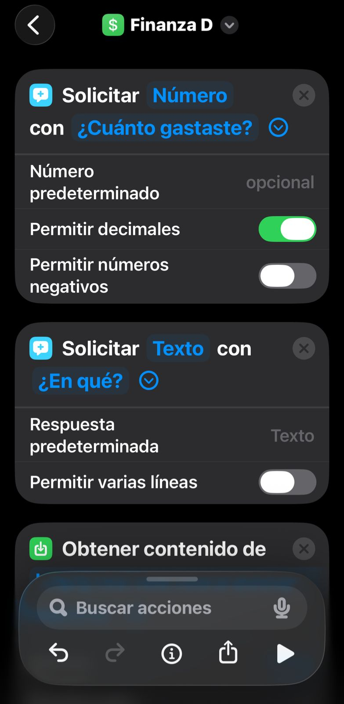

* Luego el 3er cuadro debe ser un obtener contenido de URL, y pondremos http://LA_IP_DE_DONDE_SE_ESTA_EJECUTANDO_EL_MAIN.PY/registrar
* El metodo debe ser POST

  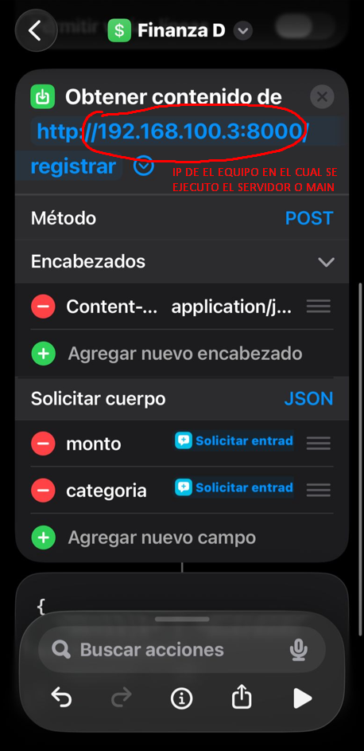

* En este paso necesitamos poner 1 Encabezado, (lo mismo que esta en el cuadro de abajo)
* Necesitamos colocar 2 cuerpos, monto y debe ser vinculado con la primera entrada de "¿Cuanto gastaste?" y categoria debe ser vinculado con la segunda entrada de "¿En qué?"

| CLAVE        | VALOR            |
| ------------ | ---------------- |
| Content-Type | application/json |

  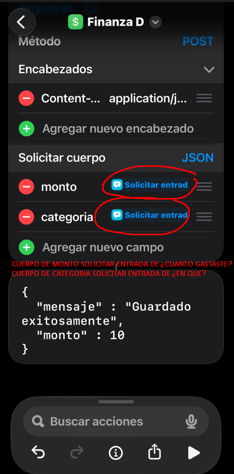

Una vez replicado todo, se puede ejecutar y mandar datos de prueba "10" y "coca cola", al final debe salir el mensaje de guardado exitosamente, para comprobar en el terminal del main debe salir:

`POST /registrar HTTP/1.1 200 OK`      (Con esto verificamos que se subio los datos)

**http://LA_IP_DE_DONDE_SE_ESTA_EJECUTANDO_EL_MAIN.PY:8000/ver-gastos** (Aquí verificamos los datos ya subidos )

# DATOS MOVILES

Reemplazamos el url anterior con lo que nos dio de resultado en el forwarding

  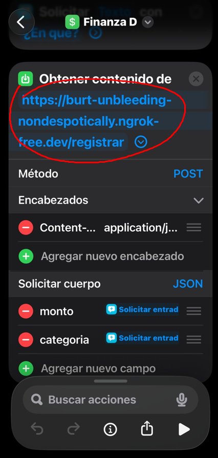

Desde el momento que le damos a ejecutar en el cmd debe aparacer que hay 1 conexión, luego de terminar de ingresar los datos y terminar debe salir en el cmd este dialogo

  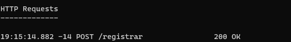

# SEGURIDAD

En el archivo main.py en sección

  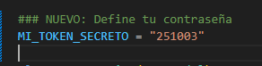

guardamos esa contraseña y es la que ponemos al crear un nuevo header

| CLAVE        | VALOR            |
| ------------ | ---------------- |
| x-token | contraseña |

  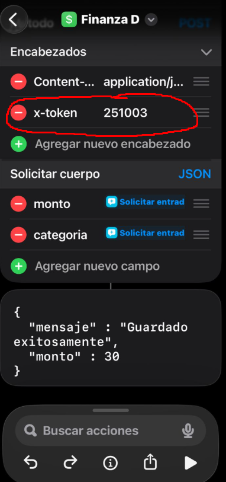

En caso de que otro usuario quiera ingresar datos y no tenga ese token lo que le va a salir es lo siguiente

  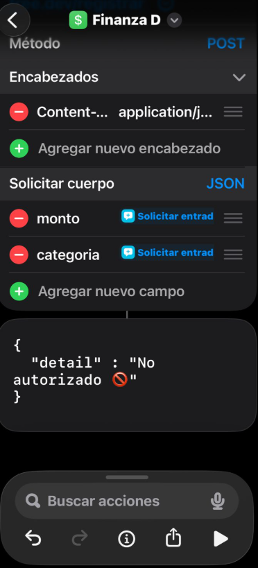

y en el cmd tanto como en el main.py y ngrok aparecera la advertencia
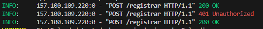
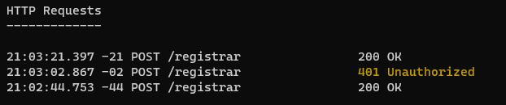

# INGRESO

* Al inicio se debe ingresar una "Lista" en el cual se debe poner dos opciones "Gasto" e "Ingreso"
 Siguiente un "Seleccionar de la lista" y se lo coloca debajo de la Lista para que conecte

  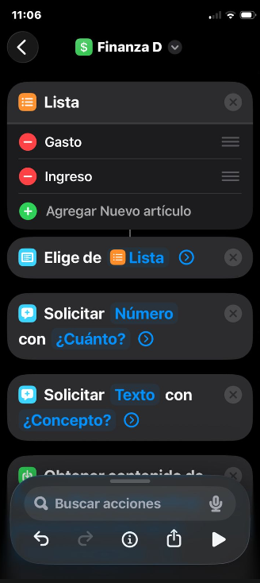

Y por ultimo se crea un cuerpo con nombre "tipo" y se le coloca la el "Seleccionar de la lista"

