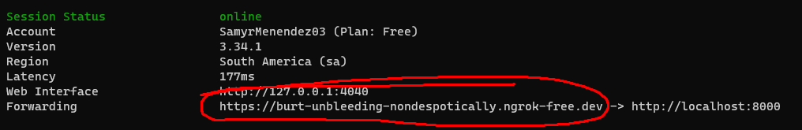

# **PARTE 1**

De momento solo tenemos la conexión mediante la misma red ahora si queremos una conexión desde datos moviles necesitamos descargar NGROK.

#### **PAGINA:**

dashboard.ngrok.com/signup

* Getting Started > Setup & Installation > Windows > Download > Download for Windows (64-Bit)

Después de descargar el zip, extraer y el .exe ponerlo en la carpeta principal, al lado de main.py, ejecutarlo, se abrira un cmd y dentro ejecutar el codigo que aparece con el token.

* **ngrok config add-authtoken $YOUR_AUTHTOKEN**

#### **COMO OBTENER EL AUTHTOKEN:**

Getting Started > Your Authtoken > Command Line

* ngrok config add-authtoken $YOUR_AUTHTOKEN

Luego para activar el servidor

* ngrok http 8000

**RECORDATORIO**

Para activar la base de datos se debe hacer en un entorno venv.

* .\venv\Scripts\activate
* uvicorn main:app --host 0.0.0.0 --port 8000 --reload

Con la información de Forwarding tendremos el url para enviar los datos a la base de datos.

[IMPLEMENTAR LO ANTERIOR A LA APP DE ATAJO](GuiaAtajo.md#datos-moviles)

# PARTE 2

# SEGURIDAD

Para aplicar seguridad al sistema de tal manera evitar que cualquier pueda ingresar datos falsos porque se sabe el URL del ngrok (como el codigo ya está listo solo falta explicar el resto).

[IMPLEMENTAR SEGURIDAD A LA APP DE ATAJO](GuiaAtajo.md#seguridad)

# GRAFICO

LIBRERIA NECESARIA:

* pip install pandas matplotlib

Esta relacionado con analisis.py.

# AUTOMATIZACION

Necesitamos crear un .bat pero tiene variación por la ruta del archivo dependiendo de la pc.

cd "C:\\Users\\Sam1R\\Desktop\\mi\_finanzas".

el resto es lo mismo, el archivo esta en la carpeta INICIAR SISTEMA.bat.

# PARTE 3

# INGRESO DE DINERO

Se realizó la creación de actualizar_db.py para actualizar la tabla de la base de datos para el ingreso de dinero.

Luego se modifico el main.py para que acepte estos mismos datos.

Ahora la configuración del atajo.

[AHORA LA CONFIGURACION DEL ATAJO](GuiaAtajo.md#ingreso)

# IMPLEMENTACION DE SEGUIMIENTO TRADING

Lo que se busca es un apartado con una grafica para las personas que operan en el mercado, en el cual podra ver un grafica de que tan rentable es ese mes si logro cubrir sus gastos gracias al trading o no.

Se creo un archivo llamado Trading.py, con este archivo tenemos ya el interfaz y la función para trabajar con la grafica.

# ACTUALIZAR .BAT

Como ya tenemos varios apartados, es muy molesto activar uno por uno asi que se modifico el INICIAR SISTEMA.bat.bat para que activara todo de un solo click.

